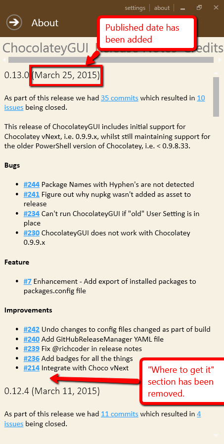

Once you have created a number of releases, you might want to export all of the release notes into a single file.  This is especially useful if you want to embed all the release notes within your application.  To cater for this, GitReleaseManager includes the export command.  The format of the resulting file can be configured via a number of parameters.

Out of the box, GitReleaseManager exports all the release notes for a given project, exactly as these release notes appear within GitHub.  However, there are certain things that you might want to add, or remove, for the exported file.

Take for example the GitReleaseManager.yaml file which is used by the [Chocolatey GUI](https://github.com/chocolatey/ChocolateyGUI) project:

```yaml
export:
  include-created-date-in-title: true
  created-date-string-format: MMMM dd, yyyy
  perform-regex-removal: true
  regex-text: '### Where to get it(\r\n)*You can .*\)'
  multiline-regex: true
```

This results in a file which looks like this:



:::{.alert .alert-info}
The important things to note in the above image are that a created date has been added for each release, via the include-created-date-in-title parameter (and it is possible to configure the DateTime format string that is used).  And also, the "Where to get it" section has not been included.  Since we are including the release notes within the Chocolatey GUI application, the user already has it installed, so they don't need to know where to get it.

Assumes that you can create the necessary regular expression, any text can be removed from the exported set of release notes.

This approach can be used for any project, this example simply shows what is done in the Chocolatey GUI project.
:::
